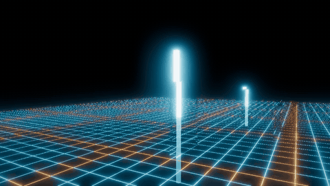

# TronGrid Lite

**Greetings, Programs!**

> The Grid. A digital frontier. I tried to picture clusters of information as they moved through
> the computer. What did they look like? Ships? Motorcycles? Were the circuits like freeways? I
> kept dreaming of a world I thought I'd never see. And then, one day... I got in.
>
> — Kevin Flynn, *Tron: Legacy*

The aim of this project is to make Flynn's grand vision become reality: a cyberworld of glass
and neon, populated by real, thinking AI creatures — the digital frontier built not as a film
set but as a running system. He kept dreaming of a world he thought he'd never see; we are
building it one honest subsystem at a time.

A deliberately simple Vulkan renderer for the Tron aesthetic — clean geometry, emissive
materials, perfectly reflective surfaces, neon glow against infinite black.



Every pixel of that is a ray, traced in an ordinary compute shader against a bounding volume
hierarchy this project builds itself. **The GPU it was recorded on exposes no ray-tracing
extensions at all** — it is a laptop GTX 1650 Ti, and it renders that scene in about fourteen
milliseconds a frame. Record your own with [`tools/record_flyby.py`](tools/record_flyby.py).

**The Grid is built for Programs, not for people.** There is no player, no controls and no
gameplay. The User watches through a debug window — a free-flight camera for development and
observation.

**It is the stage, not the actor.** TronGrid Lite renders senses and applies actions; it does
not think. Programs load as shared-library plugins (DLL on Windows, SO on Linux), receive small
buffers of senses, and return actions — so the Grid stays **completely agnostic about how any
Program works inside**. No Program internals live here, and none should: Programs are other
repositories' business, behind a plain C ABI.

**A Program can be written in any language that compiles to a shared library**, and the interface is
kept plain so that this is true rather than merely claimed: one exported symbol, and structs of
nothing but floats, fixed-width integers and pointers — no unions, bitfields, enums or packing. For
languages that cannot read a C header, the memory layout is published as data so a binding can check
itself. See [docs/PROGRAM_INTERFACE.md](docs/PROGRAM_INTERFACE.md) § Writing a Program.

It is a fresh, independent project. It reuses infrastructure and foundation code from the
author's earlier [TronGrid](https://github.com/MatejGomboc/tron-grid) renderer (same author,
same licence) but leaves behind the hardcore graphics programme — mesh shaders, hardware ray
tracing, bindless everything — so that it runs on modest GPUs and stays small enough to read in
an afternoon.

## A Note on the Vocabulary

This project uses Tron's language throughout, and unapologetically. Watching *Tron* (1982) is
strongly recommended and arguably a prerequisite. If you have not, the table below will get you
through the API — but you are missing out.

| Word | What it means here |
|------|--------------------|
| the Grid | The world this renderer simulates |
| Program | The thing that thinks — a plugin, one per creature |
| creature | The body the Grid simulates, which a Program drives |
| User | The human at the debug window, watching |
| tick | One simulation step |
| senses | What a creature perceives during a tick |
| actions | What a Program asks its creature's body to do |
| rez / derez | A Program arriving on the Grid, and leaving it |
| Master Control | The world server — the one authority every running instance of the Grid will answer to. Blueprint today: [docs/TOPOLOGY.md](docs/TOPOLOGY.md) |
| Link | The protocol library Master Control and the Grid's instances both load — the wire of the Grid. `link` names only [its repository](https://github.com/ai-quokka-wannabe/link) |

## Status

Early development, and the picture above is real output rather than a target — though it is now a
little out of date, having been recorded before the floor gained its terraced relief and its
vertical risers.

Phases 0 to 5 are done. The Grid is traced in a compute shader against a hierarchy built on the
host; surfaces reflect and refract; a bloom chain and an ACES tone curve turn radiance into a
picture; and the same hierarchy now answers acoustic rays, delivering an impulse response — energy
against delay — at an ear. One Grid, two senses, one traversal.

Phase 6 is under way: Programs plug in and perceive — ears, eyes, touch and their own voices,
through the C ABI in `libs/program-abi` — and what remains of the phase is listed in
[TODO.md](TODO.md).

## The Four Repositories

The Grid is one repository of four. This one is the flagship — the renderer, the senses, both
client roles, and the ground where every subsystem grows before it moves out.
[master-control](https://github.com/ai-quokka-wannabe/master-control) is the world server the
blueprint builds towards; [the link repository](https://github.com/ai-quokka-wannabe/link) is **Link** — the wire of the
Grid, the protocol library the server and every client load as the same shared binary; and
[rc-worm](https://github.com/ai-quokka-wannabe/rc-worm) is the first Program. Who owns what, and
why every delegation is the way it is, lives in [docs/TOPOLOGY.md](docs/TOPOLOGY.md) — one table,
kept in one place, pointed at from everywhere.

## Choosing a GPU

`--list-gpus` reports every Vulkan device on the machine, whether it can run the renderer, and why
not if it cannot. `--gpu <index>` forces one, overriding the score that otherwise always prefers a
discrete device.

```text
Vulkan devices on this machine: 2.
  [0] Intel(R) RaptorLake-S Mobile Graphics Controller — integrated, Vulkan 1.4.323 — USABLE, score 1000. Run with --gpu 0.
  [1] NVIDIA GeForce RTX 4090 Laptop GPU — discrete, Vulkan 1.4.341 — USABLE, score 10000. Run with --gpu 1.
```

Both of those are exercised on every change worth the name. **Pixels are bit-identical on one
device and close but not identical across two** — cross-device identity is not reachable, because
IEEE-754 pins neither fused-multiply-add contraction nor the transcendentals. The difference is
measured rather than assumed; see [docs/PROGRAM_INTERFACE.md](docs/PROGRAM_INTERFACE.md)
§ Determinism and Replay.

## Running it

**TronGrid Lite is a command-line program that can open a window, not a window that can be scripted.**
Creatures perceive the Grid through a senses buffer; they have no window and no swapchain, so a run
that hosts them needs no display, no surface and no present queue — and is not refused on a machine
that has none.

**The Grid is one world with many eyes on it.** Master Control hosts the world; every TronGrid Lite
is a client of it, from the very first run rather than bolted on later. Where the world is comes
first, as the one positional argument — `host:port`, defaulting to `127.0.0.1:30702` — and what you
are there comes second:

```text
TronGridLite [host:port] --window     # watch the world live
TronGridLite --debug                  # inspect the built-in stage, no world needed
```

`--window` opens a live view of the world: the creatures Master Control tells of, drawn interpolated
between the two newest ticks, with no prediction ever. If nobody is listening at the address the run
refuses loudly — "No Master Control at … - is it running?" — and there is deliberately no silent
fallback, because a fallen server must never look like an empty world. No Program is loaded in that
mode: a window is for the User's eyes, and a creature has no use for one.

`--debug` opens the same window on the built-in stage, with no server and no Program at all, so the
User can check that things are in their place — that the geometry is where it should be, that the
neon reads as neon — even where no world is running.

`--version` prints the Grid's version and its Link protocol version side by side, because that pair
is what compatibility means here; `--verbose` makes the run talkative.

A Program that wants to show its own internals opens its own window. The Grid knows nothing about how
a Program works inside and provides it no display. `[host:port] --program <name>` **hosts** the
Program's creature in Master Control's world: the body is rezzed over the wire with the render model
the Program offered, the senses are answered from the world's telling and the owner's letter (its
feel: specific force, footing, contacts), and every intent goes back for the world's physics to
judge. The host has no clock of its own - the world is the clock - and `--ticks N` bounds a run to
N world ticks before leaving politely. Watch it from a second instance with `--window`.

**A Program is named, never pathed.** Programs live in `programs/` beside the executable — as many
as you like — and a name selects one. `--list-programs` reports what is there and which of it the
Grid would accept:

```text
Programs in .../programs: 3.
  tgl_broken_wrong_version - UNUSABLE. Program "tgl_broken_wrong_version": was built against
             ABI version 7 and this Grid speaks version 6. Rebuild the Program against this header.
  tgl_driver_modelled - USABLE, ABI version 6, vtable 48 bytes. Run with --program tgl_driver_modelled.
  tgl_driver_steady - USABLE, ABI version 6, vtable 48 bytes. Run with --program tgl_driver_steady.
```

A Program built against an older ABI is a stale file that looks exactly like a current one, and only
loading it tells them apart — which is why the listing loads each one rather than reading its name.
Nothing in the folder is hidden: a library the Grid could never accept is listed with the reason
rather than left out.

`--list-programs` needs no device; hosting does, for the eyes.

The name may contain letters, digits, underscore and hyphen only. That alphabet has no dot and no
separator in it, so a name cannot reach out of that directory — which matters because the roster
will one day come from a configuration file, and a configuration file is something a downloaded
creature pack can write.

## Checking it

The modes below answer a question rather than drawing a picture. The three `--verify` modes and
`--benchmark` need a device but no display, and **the verification modes run in CI on every push**
against lavapipe, Mesa's software Vulkan driver — so a traversal regression is caught by a machine
rather than by somebody remembering to look. Only `--benchmark` still wants real hardware, which is
right: it measures a GPU. The Program modes at the end of the table need no device at all.

All of them also run over SSH or on a machine with no monitor attached.

| Command | Question |
|---------|----------|
| `--verify-acoustics` | Do the acoustic shader and the host gather agree? |
| `--verify-scene` | Do they still agree with the Grid placed at an angle, where transform arithmetic can actually be wrong? |
| `--verify-senses` | Does a creature's eye agree with the host's first hit? At one bounce the walk collapses, so the agreement is exact. |
| `--benchmark` | What does each GPU pass cost? |
| `[host:port] --program <name> [--ticks N]` | Host that Program's creature in the world at host:port (default localhost at Tron's port). |
| `--replay <disk>` | Clu: play a Disk back into the window at the speed the world ran. No Master Control needed. |
| `--mute` | The window without its ears: no audio endpoint opened, no pings, no scratches. |
| `--list-programs` | Which Programs are installed, and which of them would load? Also needs no device. |

```text
Trace 3.342041 ms | post 0.294431 ms | frame 3.636273 ms.
That is 275.006836 frames per second at 1280x720, GPU only.
```

`--benchmark` reports the device's own timestamps after discarding ten warm-up frames, and walks the
same fixed camera path `--record` does so that two runs compare. It writes nothing.

## Platforms

| Platform | Windowing | Status |
|----------|-----------|--------|
| Windows  | Win32     | Active |
| Linux    | XCB       | Active |

## Requirements

- **Vulkan SDK** 1.4.357.0+ ([LunarG](https://vulkan.lunarg.com/)) — the version CI builds against.
  The real constraint is that `slangc` and `spirv-val` must be present in the SDK's `bin` directory,
  because CMake requires both at configure time
- **C++20** compiler (MSVC, GCC, or Clang)
- **CMake** 3.25+
- **Ninja** build system
- **Rust** stable toolchain via [rustup](https://rustup.rs/) — cargo builds Link, the wire of the
  Grid, from the `external/link` submodule at build time. The built library is required to sit
  beside the executable, and the build puts it there

### Target Hardware

Any Vulkan 1.3 GPU. **No ray tracing extensions required** — ray tracing is done in plain
compute shaders. Development happens across four devices and three vendors — NVIDIA, AMD and
Intel — and one of them is a GTX 1650 Ti laptop that exposes no Vulkan ray tracing extension at
all. If it runs well there, it runs well anywhere.

## Building

Clone with `--recurse-submodules`, or run `git submodule update --init` in an existing clone —
the configure step refuses, by name, when the Link submodule is empty.

### Windows (MSVC)

```bash
cmake --preset windows-msvc
cmake --build build/windows-msvc --config Debug
```

### Windows (Clang-CL)

```bash
cmake --preset windows-clang-cl
cmake --build build/windows-clang-cl --config Debug
```

### Linux (GCC)

```bash
sudo apt-get install libxcb1-dev
cmake --preset linux-x11-gcc
cmake --build build/linux-x11-gcc --config Debug
```

### Linux (Clang)

```bash
sudo apt-get install libxcb1-dev
cmake --preset linux-x11-clang
cmake --build build/linux-x11-clang --config Debug
```

## Design Principles

1. **Programs, not players** — every design decision serves the creatures and their Programs; the
   User is an observer, never a participant
2. **Simple over clever** — the whole renderer should fit in one head
3. **Deterministic ray tracing** — perfect mirrors and emissive lighting need no Monte Carlo, no
   denoiser and no ray tracing hardware: a fixed, shallow Whitted ray tree
4. **Creature-first resolution** — animal eyes resolve far less than 800×600; creature vision
   renders tiny, and only the User's window renders big (see [docs/PERCEPTION.md](docs/PERCEPTION.md))
5. **One Grid, two senses** — a single BVH answers both visual rays and acoustic rays. `Material`
   carries optical properties only; acoustically every surface is a perfect mirror, and the one
   authored acoustic number — how loudly a surface sings — lives in its own table indexed by the
   same material slot
6. **Incremental** — every phase produces something visible

## Material Model

The entire surface vocabulary of the Grid:

Every surface is one perfectly smooth material that is reflective, translucent and emissive at
once — no types, no branches, just parameters:

| Parameter | Meaning |
|-----------|---------|
| `colour` | Tint applied to reflected and transmitted light. Usually near-black |
| `index_of_refraction` | Drives Fresnel everywhere, and Snell refraction where light passes through |
| `emission` | Radiance the surface emits — this is the neon |
| `transmission` | How much non-reflected light passes through rather than being absorbed |

"Mirror", "neon" and "glass" are named points in that space rather than categories, so a glowing
translucent surface is as ordinary as any of them.

There is no roughness, no microfacet model and no textures. That is not a simplification of
physically-based rendering but its smooth limit: as roughness goes to zero the microfacet
distribution collapses and the BRDF reduces analytically to Fresnel-weighted mirror reflection
plus refraction. Each bounce is therefore exactly one ray, the tree is shallow and deterministic,
and there is no Monte Carlo variance to denoise. The aesthetic *is* the algorithm: Whitted ray
tracing, 1980 edition, running in compute.

## Build Plan

| Phase | Goal | Milestone |
|-------|------|-----------|
| 0 - Foundation | Prove the toolchain | Triangle on screen |
| 1 - Infrastructure | Window, swapchain, frame loop | Fly through a wireframe grid |
| 2 - Compute Tracer | BVH plus primary rays in compute | Mirror world, first bounce |
| 3 - Full Ray Tree | Reflections, emissives, glass | The Tron look, correct |
| 4 - Post Processing | Bloom, tonemapping | The Tron look, beautiful |
| 5 - Acoustic Rays | Audio paths through the same BVH | Echoes and occlusion |
| 6 - Programs | Creature sensor interface | A Program plugs in and perceives |

## Documentation

| Document | Purpose |
|----------|---------|
| [docs/VISION.md](docs/VISION.md) | What the Grid is for and where it is going |
| [docs/ARCHITECTURE.md](docs/ARCHITECTURE.md) | How the renderer is put together |
| [docs/MATERIALS.md](docs/MATERIALS.md) | The material model, the Fresnel and refraction maths, and the HDR path |
| [docs/PERCEPTION.md](docs/PERCEPTION.md) | Creature sensor resolutions and the biology behind them |
| [docs/ACOUSTICS.md](docs/ACOUSTICS.md) | How hearing works on the Grid, and the decisions behind it |
| [docs/PROGRAM_INTERFACE.md](docs/PROGRAM_INTERFACE.md) | The plugin contract between the Grid and a Program |
| [docs/TOPOLOGY.md](docs/TOPOLOGY.md) | How the Grid becomes a world: the four repositories, the three processes and the wire, on audited MMO practice |
| [docs/RELATED_WORK.md](docs/RELATED_WORK.md) | What research labs build in this area, and what is genuinely unusual here |
| [docs/research/](docs/research/) | Literature surveys and citations that design decisions rest on |
| [docs/DEV_ENV_SETUP.md](docs/DEV_ENV_SETUP.md) | Setting up a development environment |
| [tools/README.md](tools/README.md) | Scripts that operate on the renderer, including the flyby recorder |
| [CONTRIBUTING.md](CONTRIBUTING.md) | How to contribute |
| [STYLE.md](STYLE.md) | Code style conventions |
| [TODO.md](TODO.md) | Roadmap and open etapes |

## References

- [Vulkan Tutorial](https://vulkan-tutorial.com)
- [vkguide.dev](https://vkguide.dev)
- [Sascha Willems Vulkan Samples](https://github.com/SaschaWillems/Vulkan)
- [Slang Shader Language](https://shader-slang.org)
- Whitted, T. (1980). *An improved illumination model for shaded display*

## The Vision

> A digital creature will wake up on the Grid.
> It will see neon lines against infinite black —
> through eyes that resolve less than an old CRT,
> and that is enough, because it has always been enough
> for every animal that ever chased, hid, and played.
>
> The Grid does not need four thousand lines of resolution.
> It needs to be *true*: every reflection honest,
> every echo travelling the same Grid as every glint.
> A small world, rendered simply, perceived completely.

## Licence

Copyright © 2026 Matej Gomboc <https://github.com/ai-quokka-wannabe/tron-grid-lite>.

This program is free software: you can redistribute it and/or modify
it under the terms of the GNU General Public License as published by
the Free Software Foundation, either version 3 of the License, or
(at your option) any later version.

This program is distributed in the hope that it will be useful,
but WITHOUT ANY WARRANTY; without even the implied warranty of
MERCHANTABILITY or FITNESS FOR A PARTICULAR PURPOSE. See the
GNU General Public License for more details.

See the attached [LICENCE](LICENCE) file for more info.
